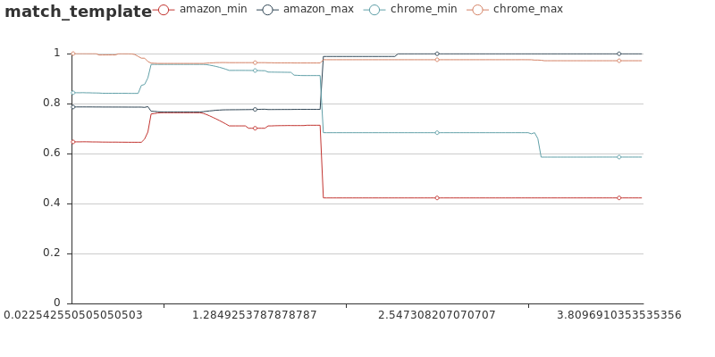

# stagesep2


[](https://badge.fury.io/py/stagesep2)
[](https://travis-ci.org/williamfzc/stagesep2)
[](https://codeclimate.com/github/williamfzc/stagesep2/maintainability)

---

Analyse, and convert video into useful data.

# 原理

stagesep2 的两个核心功能：

- ocr（tesseract）
- 图像识别（opencv）

视频是由一系列连续的图片（帧）组成的，通过逐帧分析，我们能够从视频中提取出流程相关信息。理论上，每一帧都存在能够区分它与其他帧的标识，可能是文字或图像。

例如，我们需要测试 从桌面启动chrome，打开amazon 的速度：

- 在操作前，我们在主页。主页上会有特定的文字与图像（例如chrome icon）
- 在操作时，页面会有特定的变化（例如chrome icon变暗，或出现点击位置反馈）
- 在操作后（chrome启动后），页面发生切换，页面上的文字与图像都会发生改变（例如amazon logo出现）

那么，我们可以通过两个方面来进行检测。首先是通过标志性图片：



可以看到，在 0.2s 时chrome图标被点击，在 0.96s 时amazon图标正式出现。再看看文字的：

```json
{
	"result_id": "c2e5116c-462b-11e9-9ed2-005056c00008",
	"video_name": "./videos/demo1.mp4",
	"frame_id": 24,
	"current_time": 0.96,
	"ocr": ["PO", "/", "1dX00d", "¥", ":", "00Xv00Yv00", "—", "ESRRGRERSize0.0215", ":", "27dSlsB", "(", "ayhttps", "/", "/", "www", ".", "amazon", ".", "comQO", "°", "oa", "\"", "四", "Ney", ",", "DepartmentsListsDealsVideoMusic", "©", "DelivertoChinaWeshipinternationallyWe", "'", "reshowingyouitemsthatshiptoChina", ".", "Toseeiemsthatshiptoadifferentcountrychangeyourgetiveryaddres5AdditionallanguagesettingsareavailableSomecontentmaybeauto", "-", "translatedCHANGETHEADDRESSrs", "并", "~", "Shopwith100%", "ConfidenceonAmazonLJ", "—", ")", "SigninforthebestexperienceCoO00", "@"],
	"match_template": {
		"amazon": {
			"min": -0.4684264361858368,
			"max": 0.6224471926689148
		},
		"chrome": {
			"min": -0.4022962152957916,
			"max": 0.7294253706932068
		},
		"chrome_clicked": {
			"min": -0.6132965087890625,
			"max": 0.7038567066192627
		}
	},
	"trend": {
		"previous": 0.8785946933890821,
		"first": 0.8719320065296263,
		"last": 0.5842399940047383
	}
}
```

节选 0.96s 的检测结果，可以发现在该时刻amazon网页上的相关字样开始出现，与图片检测的结果是一致的。

通过对这些阶段进行分析，得到每个阶段及帧对应的时间戳，我们就能够准确地知晓视频每个阶段发生的事情。你的视频FPS越高，数据会越精确。

# 目的

> 值得注意的是，在性能测试范畴内，fps的稳定性是非常重要的。而目前软件录制手段实际上并不稳定，容易造成结果不准确的问题。如果用于生产环境，建议使用硬件方式（例如外置摄像头）。

全平台的 性能测试/有效性验证 方案

- 渲染内容是否符合期望
- 渲染性能

## 为什么介入图像识别

### UI

现阶段的UI测试大多属于纯代码层面的行为，而对于控件是否真的渲染成为我们希望的样子我们并不知晓。

### 性能

在常规速度类性能测试中通常通过提前埋点进行测试，一般会有两个问题：

- 具有侵入性（需要改动源码）
- 对于界面相关的场景不适用（并不知道界面是否已经被真正渲染出来）

## 图像识别在测试中的应用

一般来说，通过图像识别来进行测试分为三个步骤：

- 图像/视频 采集
    - 这个部分通常由高速摄像机或稳定帧率的外置相机进行拍摄，得到固定帧率的视频
    - 软件录制是不靠谱的，很容易出现帧率不稳定的情况。而如果时间与帧数不能精确对应的话数据会失真

- 视频处理
    - 提取视频中的信息，输出成为我们需要的形式
    - 也是整个流程最关键的部分

- 数据分析
    - 将视频处理的结果进行分析，得到结论或生成报告

该项目将承载视频处理的部分，将录制好的视频解析成开发者需要的格式。

# 使用

目前支持两种使用方式：

- docker（推荐）
- python包

从 [官方示例](https://github.com/williamfzc/stagesep2-sample) 开始吧。

# 相关内容

## 依赖

- [opencv](https://opencv-python-tutroals.readthedocs.io/en/latest/py_tutorials/py_tutorials.html): 图像与视频处理
- [tesseract-ocr](https://github.com/tesseract-ocr/tesseract/wiki/Downloads) & [tesserocr](https://github.com/sirfz/tesserocr): 文本检测
- [skimage](https://github.com/scikit-image/scikit-image): 主要用于图片相似度比较
- [jieba](https://github.com/fxsjy/jieba)：ocr结果的进一步处理
- [pyecharts](https://github.com/pyecharts/pyecharts)：结果图表渲染

## 旧版本

- [stagesep](https://github.com/williamfzc/stagesep)
- [利用图像识别与 OCR 进行速度类测试](https://testerhome.com/topics/16063)

# Bug与建议

欢迎通过 issue 告知，或直接发起 PR 加入 :)

# 协议

[MIT](LICENSE)
